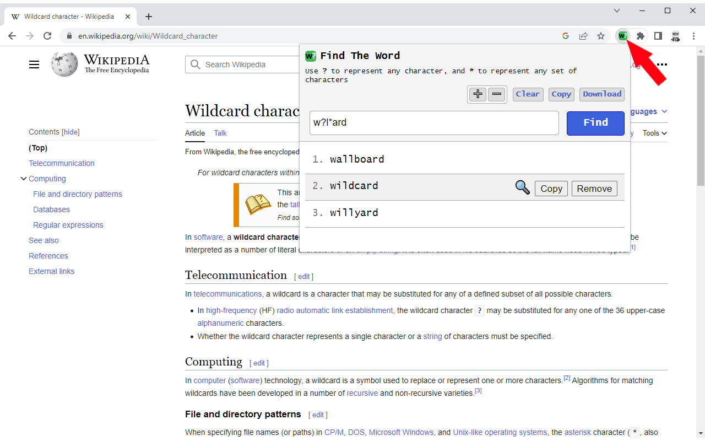
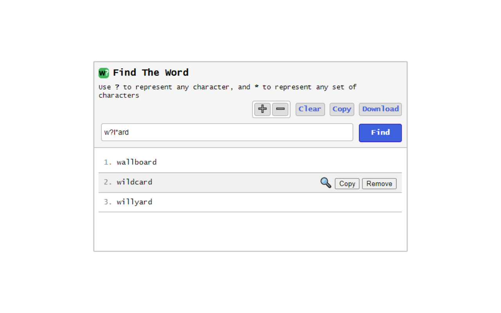

#  Chrome Extension - Find The Word

Chrome extension to find an English word using wildcards (?,*)

## Features

- Dictionary of about **275000** terms
- Search using wildcards **(?,*)**
- **?** to represent any character
- <b>*</b> to represent any set of characters
- Copy single result
- Removing unwanted results
- Copy all results
- Saving of all results in a text file
- Text zoom
- Search results on Google

## Search examples
Searching for **wo?d** will yield the following results:

- wo**a**d
- wo**l**d
- wo**o**d
- wo**r**d

Searching for **wor*d** will yield the following results:

- word
- wor**dboun**d
- wor**de**d
- wor**karoun**d
- wor**ke**d
- ...

# Links
- Home page: https://www.vincenzodevivo.com/
- GitHub: https://github.com/deltavi

# ☕BUY ME A COFFEE
Want to buy me a coffee? By all means! Visit 
https://www.buymeacoffee.com/vincenzodevivo or https://www.paypal.com/paypalme/VincenzoDeVivoAutore

... or you can buy my books on Amazon 📚 https://www.amazon.it/Vincenzo-De-Vivo/e/B09MPTBBFY

## Screenshots

